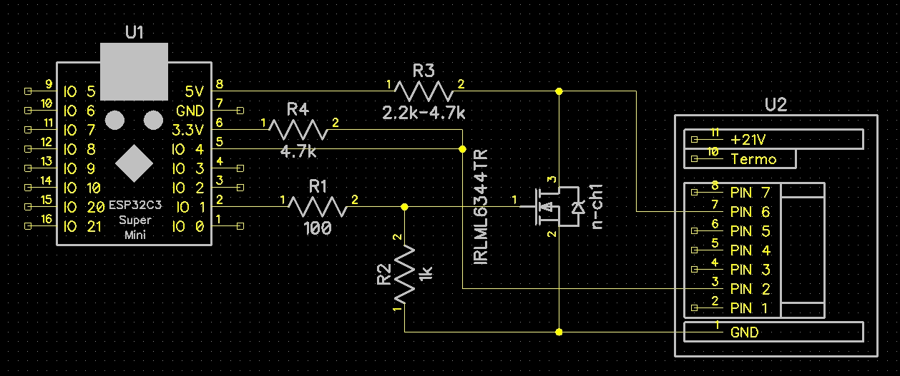

# Диагностика аккумуляторов Makita на ESP32 с веб-интерфейсом

 <!-- Загрузите фото в репозиторий и вставьте сюда ссылку -->

Этот проект представляет собой автономное устройство на базе ESP32С3 SuperMini для полной диагностики Li-ion аккумуляторов Makita LXT. 
Устройство создает веб-сервер, доступ к которому можно получить с любого смартфона или компьютера по Wi-Fi для просмотра напряжений ячеек, температуры, циклов заряда и выполнения сервисных функций.

## Ключевые возможности

*   **Полная совместимость:** Поддерживаются как стандартные контроллеры, так и более редкие F0513.
*   **Интерактивный Веб-интерфейс:** Адаптивный дизайн для мобильных и десктопных устройств.
*   **Визуализация в реальном времени:** Графическое отображение сборки аккумулятора с цветовой индикацией состояния каждой ячейки.
*   **Расчет SOC:** Автоматический расчет уровня заряда (State of Charge) на основе среднего напряжения.
*   **Сервисные функции:** Возможность запускать тест светодиодов и сбрасывать ошибки BMS (для поддерживаемых моделей).
*   **Мультиязычность:** Поддержка русского и украинского языков.

## Аппаратные компоненты

*   Микроконтроллер **ESP32** (любая модель, например, Wemos D1 Mini ESP32 или NodeMCU-32S).
*   N-chanal транзистор **IRLML6344TRPBF** (любой с управлением логическим уровнем *L в маркировке).
*   Резистор **100 Ом** и **1 кОм** (для затвора транзистора).
*   Резистор **4.7 кОм** (подтягивающий резистор, рекомендуется для совместимости со старыми батареями номинал подбирать до уверенного просыпания батареи 2,2кОм а то и ниже).
*   Коннектор для подключения к аккумулятору Makita.

## Схема подключения

*Схема реализована на транзисторном ключе для согласования логических уровней 3.3В (ESP32) и 5В (BMS).*

*   **Пин `Enable` батареи** -> к **Стоку** транзистора.
*   **Сток** транзистора -> через резистор **4.7 кОм** -> к **+5В** на ESP32.
*   **Затвор** транзистора -> через резистор **100 Ом** -> к управляющему **GPIO 1** на ESP32.
*   **Затвор** транзистора -> через резистор **1 кОм** -> на **Исток** транзистора для уверенного запирания.
*   **Исток** транзистора -> к **GND**.
*   **Пин данных (Data)** батареи -> к **GPIO 4** на ESP32.
*   **GPIO 4** ESP32 -> через резистор **4.7 кОм** -> к **+3.3В** на ESP32.

## Прошивка

Проект модифицирован для среды Arduino.
1.  Подключите библиотеки:
    * ArduinoJson от Benoit Blanchon; (компилировалось с версией 7.4.3).
    * Async TCP от ESP32Async; (компилировалось с версией 3.5.0).
    * EPS Async WebServer от ESP32Async; (компилировалось с версией 3.12.0).
2.  Подключите плату esp32 от Espressif System; (компилировалось с версией 3.3.11).
3.  Для загрузки шаблона сайта необходимо скачать и установить плагин arduino-spiffs-upload-1.1.5.vsix.
4.  Откройте проект в Arduino.
5.  Подключите ESP32 к компьютеру.
6.  Выберете порт и плату "ESP32C3 Dev Module".
7.  В разделе Инструменты -> установить параметры^
    * USB CDC on BOOT = Enabled;
    * CPU Frequncy = 80MHz;
8.  Запустите Скетч -> Проверить/Скомпилировать в Arduino для проверки корректности кода и наличия всех установленных библиотек.
9.  Для прошивки выполните команду Скетч -> Загрузить на плату и запуска монитора порта.
10.  Загрузка шаблона сайта:
     Убедитесь, что внутри папки со скетчем есть папка data со всеми вашими веб-файлами (index.html, style.css, app.js). 
    [1] Выберите вашу плату и COM-порт в верхней панели. 
    [2] Нажмите комбинацию клавиш Ctrl + Shift + P для Win (или Cmd + Shift + P на Mac), чтобы открыть Палитру команд. 
    [3] Введите в появившейся строке поиска:Для LittleFS: Upload LittleFS to Pico/ESP8266/ESP32.Для SPIFFS: Upload SPIFFS to Pico/ESP8266/ESP32. 
    [4] Кликните по этой команде. В терминале снизу начнется сборка образа и его прошивка в память платы.

## Изменения

1.  Изменен IP адрес на 192.168.1.15
2.  Добавлен автоматический переход на страницу после подключения к точке доступа.
3.  Русифицирован лог для монитора порта.
4.  Внесены оптимизации для работы WiFi (установлена оптимальная выходная мощности, включен режим сна в момент простоя).

## Лицензия

Проект распространяется под лицензией MIT. См. файл `LICENSE` для подробностей.
